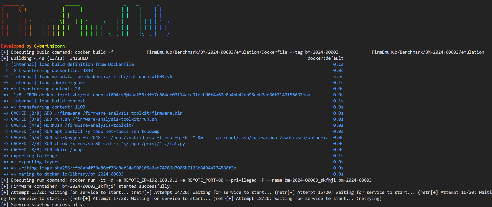

# IoT Benchmark Emulator

[English](README.md) | [简体中文](readme/README_zh.md)

This script is designed to emulate IoT firmware using Docker containers. It builds and runs a Docker image based on a specified benchmark configuration, and attempts to start a service within the container.

## Available Benchmarks

We provide a collection of IoT firmware benchmarks from various vendors. Each benchmark is identified by a unique ID in the format `BM-YYYY-XXXXX`, where:
- `YYYY`: Release year
- `XXXXX`: Serial number

For example, `BM-2024-00001` represents the first benchmark released in 2024.

For a complete list of available benchmarks and their corresponding device information, including:
- Vendor and model information
- Firmware version
- Device description

Please check [DEVICES.md](DEVICES.md).

## Prerequisites

- Python $\geq$ 3.8
- Docker

## Installation

1. **Clone the repository:**

   ```bash
   git clone https://github.com/a101e-lab/iot-benchmark.git
   cd iot-benchmark
   ```

2. **Install the required Python packages:**

   ```bash
   pip install -r requirements.txt
   ```

## Benchmark Directory Structure

Each benchmark directory should follow this structure:

```
BM-YYYY-XXXXX/         # Benchmark directory (e.g., BM-2024-00001)
├── auth/             # Authentication related files
│   └── update.py     # Authentication update script 
├── emulation/        # Emulation related files
│   ├── firmware/     # Firmware files directory
│   │   └── wr940nv4_us_3_...  # Firmware file
│   ├── Dockerfile    # Docker configuration
│   └── run.sh        # Emulation run script
└── benchmark.yml     # Benchmark configuration file
```

**Note:** The `auth` directory is optional and only needed if the firmware requires authentication.

## Usage

1. **Prepare your benchmark configuration:**

   Ensure you have a `benchmark.yml` file in your benchmark directory. This file should contain the necessary configuration for building and running the Docker container.

2. **Run the script (use `sudo` if necessary):**

   ```bash
   sudo python3 emulation.py -b <path-to-benchmark-directory>
   ```

   Replace `<path-to-benchmark-directory>` with the path to your benchmark directory containing the `benchmark.yml` file.

   For example:

   ```bash
   sudo python3 emulation.py -b ./Benchmark/BM-2024-00001
   ```

   

   **Note:** `sudo` is required because Docker commands may need elevated permissions.

## Troubleshooting

- Ensure Docker is running and accessible from your command line.
- Verify that the `benchmark.yml` file is correctly formatted and contains all necessary fields.
- Check Docker logs for any issues with the container startup.

## License

This project is licensed under the Apache 2.0 License - see the [LICENSE](LICENSE) file for details.

