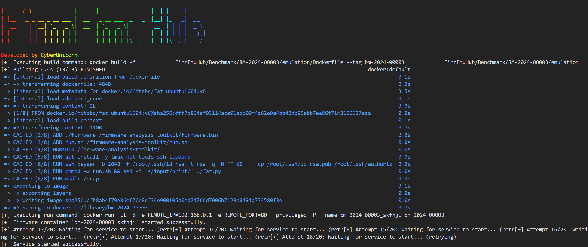

# IoT 基准测试模拟器

[English](../README.md) | [简体中文](README_zh.md)

此脚本旨在使用 Docker 容器模拟 IoT 固件。它根据指定的基准测试配置构建并运行 Docker 镜像，并尝试在容器内启动服务。

## 可用基准测试

我们提供了来自不同厂商的 IoT 固件基准测试集合。每个基准测试都有一个唯一的 ID，格式为 `BM-YYYY-XXXXX`，其中：
- `YYYY`：发布年份
- `XXXXX`：序号

例如，`BM-2024-00001` 表示 2024 年发布的第一个基准测试。

有关可用基准测试的完整列表及其对应的设备信息，包括：
- 厂商和型号信息
- 固件版本
- 设备描述

请查看 [DEVICES.md](../DEVICES.md)。

## 前置要求

- Python $\geq$ 3.8
- Docker

## 安装

1. **克隆仓库：**

   ```bash
   git clone https://github.com/a101e-lab/FirmEmuHub.git
   cd FirmEmuHub
   ```

2. **安装所需的 Python 包：**

   ```bash
   pip install -r requirements.txt
   ```

## 基准测试目录结构

每个基准测试目录应遵循以下结构：

```
BM-YYYY-XXXXX/         # 基准测试目录（例如：BM-2024-00001）
├── auth/             # 认证相关文件
│   └── update.py     # 认证更新脚本
├── emulation/        # 模拟相关文件
│   ├── firmware/     # 固件文件目录
│   │   └── wr940nv4_us_3_...  # 固件文件
│   ├── Dockerfile    # Docker配置文件
│   └── run.sh        # 模拟运行脚本
└── benchmark.yml     # 基准测试配置文件
```

**注意：** `auth` 目录是可选的，仅在固件需要认证时才需要。

## 使用方法

1. **准备基准测试配置：**

   确保在基准测试目录中有 `benchmark.yml` 文件。该文件应包含构建和运行 Docker 容器所需的配置。

2. **运行脚本（必要时使用 `sudo`）：**

   ```bash
   sudo python3 emulation.py -b <path-to-benchmark-directory>
   ```

   将 `<path-to-benchmark-directory>` 替换为包含 `benchmark.yml` 文件的基准测试目录路径。

   例如：

   ```bash
   sudo python3 emulation.py -b ./Benchmark/BM-2024-00001
   ```

   

   **注意：** 由于 Docker 命令可能需要提升权限，因此需要使用 `sudo`。

## 故障排除

- 确保 Docker 正在运行并可从命令行访问
- 验证 `benchmark.yml` 文件格式正确且包含所有必要字段
- 检查 Docker 日志以排查容器启动问题

## 许可证

本项目采用 Apache 2.0 许可证 - 详见 [LICENSE](../LICENSE) 文件。